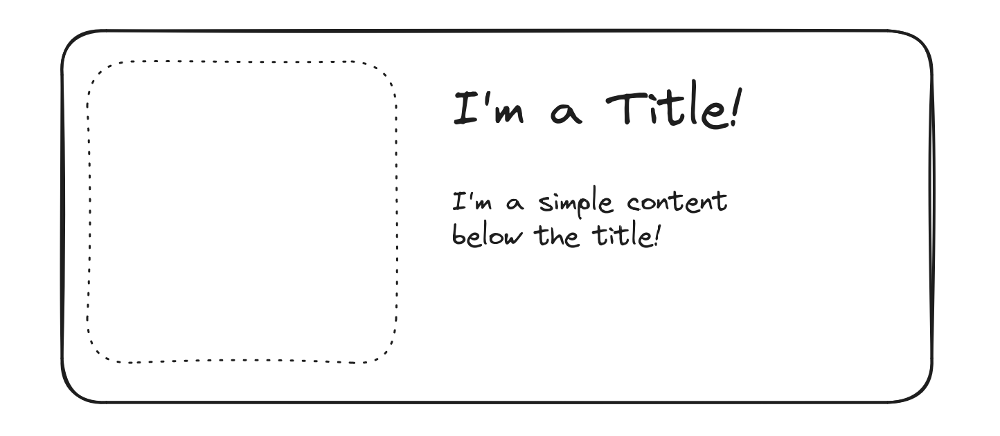

## Tasks:
1. initial tailwind empty project, that shows a `Hello Tailwind!` in a big middle screened green text
2. make a shadowed box, with a square

   

3. test `inner shadow` on image of above card
4. in a paragraph, change `font` , `text orientation`, `characters spacing`, `case`
5. in above paragraph, change `decoration's`color of the underline, type, offset
6. make a rounded box, and check its `width` and `height` (full, screen, 1/2, fix pixels, …)
7. make a big box and an `absolute` small box inside it. change the position of the small box inside (check also inset-x,y)
8. create two boxes in one row (float)
9. use gradient background, different directions

## sample output:

## TODO:
- a practice about using `outline`, and `accent`
